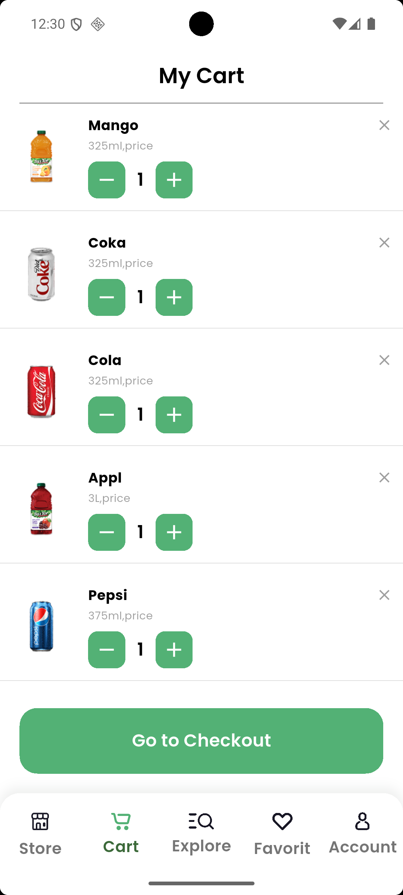

# 🛒 Green Mart (Nectar) - Flutter E-Commerce Application

A comprehensive, production-ready Flutter e-commerce application focused on grocery and fresh product shopping. This project was built to implement and showcase core mobile development concepts, clean UI/UX rendering, and state management practices learned throughout the course.

---

## 📸 Screenshots

<p align="center">
  
  
  
  
  
  
  
  
  
    
  
  
  
  

</p>

---
## 🚀 Features

*   **Modern UI/UX:** Clean, intuitive layout inspired by the Nectar design, featuring smooth transitions and responsive widgets.
*   **Product Discovery:** Categorized items, search capabilities, and detailed product views.
*   **Cart & Checkout Management:** Full cart lifecycle management (Add, Update Quantity, Remove, and Price Calculation).
*   **Clean Code Architecture:** Structured folder architecture separated by features/layers for high maintainability.

---

## 🛠️ Tech Stack & Architecture

*   **Framework:** Flutter (Dart)
*   **State Management:** Built using robust state management to separate business logic from the UI.
*   **Local/Remote Data Handling:** Organized models and repositories for seamless data parsing.
*   **Asset Optimization:** Custom SVG icons and compressed images for optimal performance.

---

## 📂 Project Structure

Here is a glimpse of how the project is structured:
```text
lib/
├── core/            # Network, themes, constants, and shared widgets
├── data/            # Models, repositories, and data sources
├── logic/           # State management configurations
└── presentation/    # UI Screens (Splash, Home, Cart, Product Details, etc.)